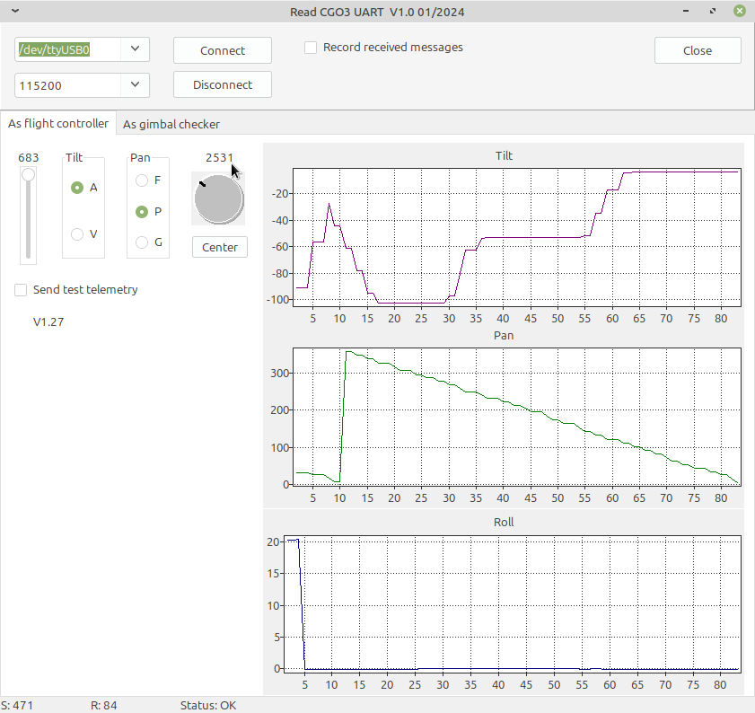

# CGO3Plus control
This application sends messages to the CGO3+ to control gimbal functions like tilt or pan. You can record answer-messages from the camera and gimbal for analysis or documentation.

There are two main functions:
- You can act as flight controller. You have switsches and slider for the gimbal like the ST16 has. This opens possibilities to reuse the camera for other purposes.
- You can act as Gimbls checker to read extended data from the gimbal. Currently the serial number and the firmware versions for the subsystems - more to come.

To compile this tool you need the common units from this repo: https://github.com/h-elsner/common_units
