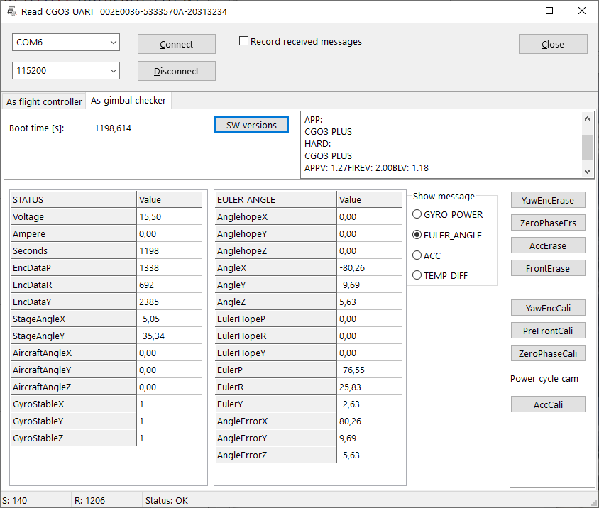

# YTHtool - connect and use Typhoon H UART s
This application sends messages to the CGO3+ to control gimbal functions like tilt or pan. You can record answer-messages from the camera and gimbal for analysis or documentation.

There are two main functions:
- You can act as flight controller. You have switsches and slider for the gimbal like the ST16 has. This opens possibilities to reuse the camera for other purposes. This ia a Demo.
- You can act as Gimbls checker to read extended data from the gimbal. It may work as calibration tool for the CGO3+. But there is no warranty. Just to be clear, you use it on your own risk.
- You can act Tyhoon H GUI application. Now the GUI is also available for LINUX user. Still under development...

NOTE: Test telemetry will only be recorded by ST16 in flight logs if flight controller is connected (via SR24) and sends telemetry too.

**WARNING:** Do not erase data from CGO3+ when you not sure what you do. *You will not get back deleted data!* Calibration may halp but there is no warranty.

To compile this tool you need the common units from this repo: https://github.com/h-elsner/common_units
Also the packages Synapse and Industrial stuff have to be installed (use OPM).
