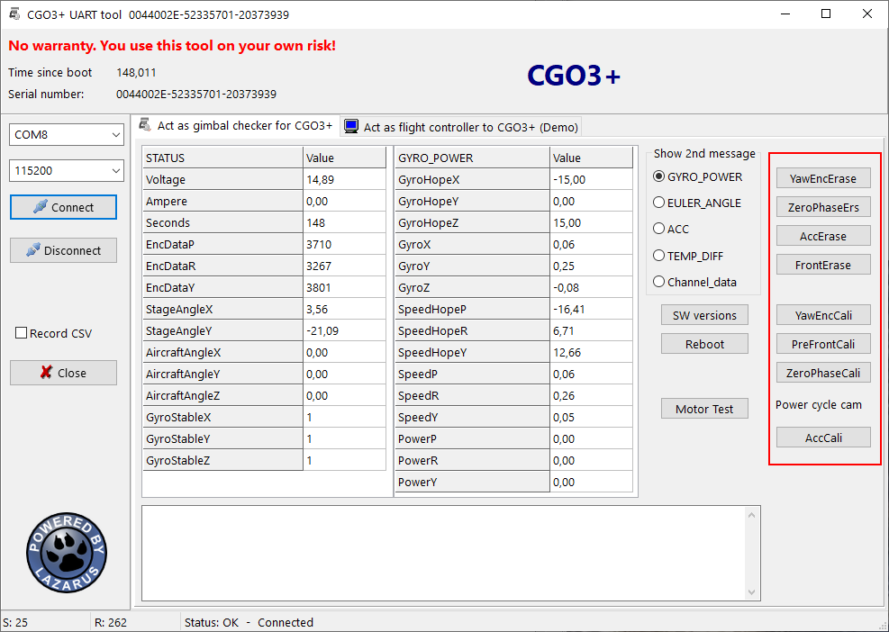
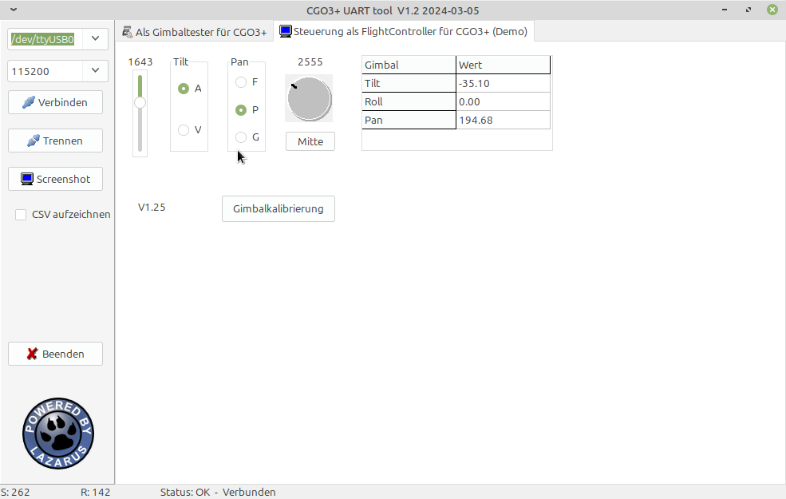

# CGO3+ UART tool (CGO3PUARTtool)

This tool provides UART (serial) connection to the CGO3+ or CGO-ET for Typhoon H (not those for H520) camera.  
Once connected the tool offers three functions:  
- Act as gimbal checker. With this function you can read and record a lot of data coming from gimbal or camera itself. And you can try to calibrate the gimbal.  
- Act as flight controller to tilt and rotate the camera. This offers the possibility to reuse the camera for other purposes. This part is only a demo.

  
**CGO3+ calibration**
The gimbal checker provides a possibility to fully calibrate the gimbal of the CGO3+. This functionality is experimental. Use it on your own risk.
  

  
  
**CGO3+ control (Demo)**  
The is a demo project how to control tilt and pan by your own application. It offers all possibilities that ST16 has including Gimbal Calibration as it would be initiated from ST16 menu.   
  

  
  
To compile this tool you need the common units from this repo: https://github.com/h-elsner/common_units
Also the packages Synapse and Industrial stuff have to be installed (use OPM).
